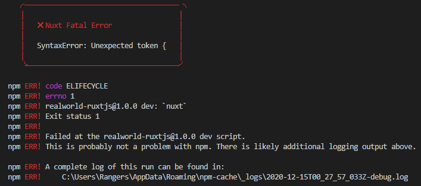
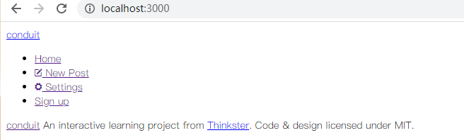
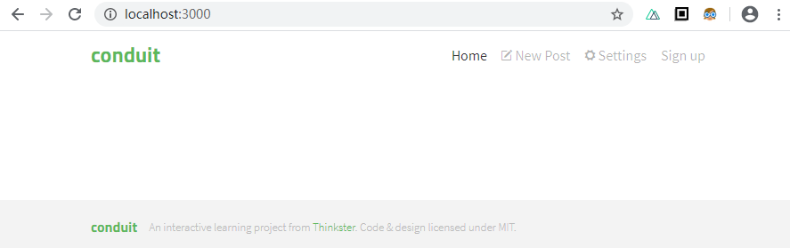
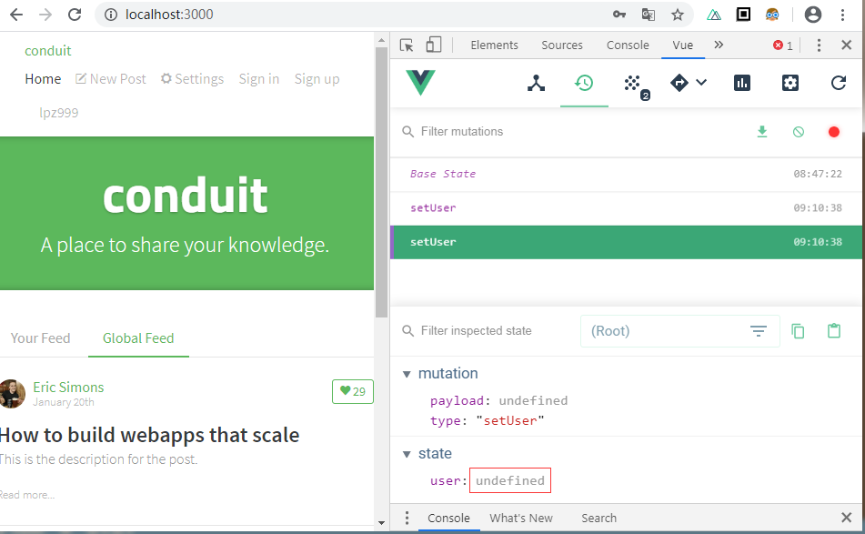
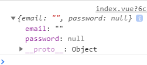

NuxtJS项目案例--RealWorld

##### 1问题：执行有错

原因：看视频不仔细，router: {[ 多了个“[]”
解决：去掉[]

    module.exports = {
        router: {[
            extendRoutes(routes, resolve) {
                //清除 Nuxt.js 基于 pages 目录默认生成的路由表规则
                routes.splice(0);

                routes.push(...[
                    {
                        path: '/',
                        component: resolve(__dirname, 'pages/layout'),
                    }
                ])
            }
        }
    }

##### 2问题：没有样式出来 

    <!-- Import Ionicon icons & Google Fonts our Bootstrap theme relies on -->
    <link href="https://cdn.jsdelivr.net/npm/ionicons@2.0.1/css/ionicons.min.css" rel="stylesheet" type="text/css">
    <link href="//fonts.googleapis.com/css?family=Titillium+Web:700|Source+Serif+Pro:400,700|Merriweather+Sans:400,700|Source+Sans+Pro:400,300,600,700,300italic,400italic,600italic,700italic" rel="stylesheet" type="text/css">
    <!-- Import the custom Bootstrap 4 theme from our hosted CDN -->
    <link rel="stylesheet" href="./static/index.css">
原因：可能是相对路径的原因
解决：把老师的源代码复制过来就有了
    
    <link rel="stylesheet" href="/index.css">

##### 3问题：将登录状态存储到容器中，登录后的state并没有出来对象，而是undefined

原因：/api/user.js 里面的 method 写成了 methods
解决：去掉s 
